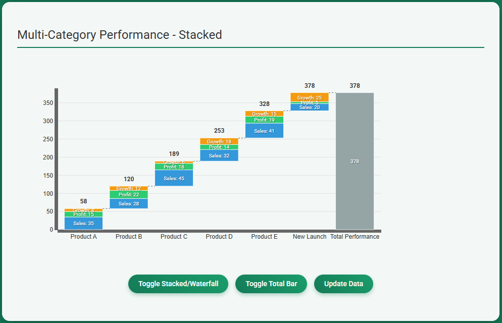

# MintWaterfall

[](https://github.com/coredds/MintWaterfall/actions/workflows/basic-checks.yml)
[](https://github.com/coredds/MintWaterfall/actions/workflows/security.yml)
[](https://opensource.org/licenses/MIT)
[](https://github.com/coredds/MintWaterfall/releases)
[](https://codecov.io/gh/coredds/MintWaterfall)

A D3.js-compatible waterfall chart component with comprehensive testing and automated CI/CD.

**[Live Demo](https://coredds.github.io/MintWaterfall/mintwaterfall-example.html)** - Try it out!

## Features

- **🚀 Production Ready**: 206 comprehensive tests with extensive coverage
- **📈 Trend Line Analysis**: Linear, moving average, and polynomial trend overlays with real-time configuration
- **🔄 Advanced Data Loading**: CSV, JSON, TSV support with HTTP URL loading and automatic format detection
- **🖼️ Enhanced Export Options**: High-DPI PNG (2x scaling), SVG, JPEG, PDF export capabilities
- **⚡ D3.js v7 Compatible**: Full integration with D3.js v7+ ecosystem and scale system support
- **🎨 Dual Visualization Modes**: Toggle between stacked and waterfall chart types
- **✨ Advanced Interactions**: Brush system, staggered animations, scale switching, and responsive design
- **🔧 Developer Friendly**: Method chaining API, robust validation, comprehensive error handling
- **🎯 Automated CI/CD**: Complete GitHub Actions pipeline with testing, security audits, and deployment
- **♿ Accessibility**: WCAG 2.1 compliance with modern Forced Colors Mode support

## Quality & Testing

- **206 Test Cases**: Comprehensive test suite covering all functionality including trend lines, data loading, and exports
- **Enhanced Coverage**: Improved test coverage across all modules with detailed reporting
- **Zero Lint Issues**: Clean, maintainable code following ESLint best practices
- **Security Audits**: Automated dependency vulnerability scanning via GitHub Actions
- **Continuous Deployment**: Auto-deployment to GitHub Pages with release automation
- **D3.js v7 Compatibility**: Full scale system support and API compatibility validation

## Installation & Usage

### Browser (ES6 Modules)

```html
<!DOCTYPE html>
<html>
<head>
    <script src="https://d3js.org/d3.v7.min.js"></script>
</head>
<body>
    <svg id="chart"></svg>
    
    <script type="module">
        import { waterfallChart } from './mintwaterfall-chart.js';
        
        // Your chart code here
    </script>
</body>
</html>
```

### Node.js / NPM (Future Release)

```bash
npm install mintwaterfall
```

```javascript
import { waterfallChart } from 'mintwaterfall';
// or
const { waterfallChart } = require('mintwaterfall');
```

## Quick Start Example

```javascript
import { waterfallChart } from './mintwaterfall-chart.js';

const data = [
    {
        label: "Q1 Revenue",
        stacks: [
            { value: 45000, color: "#3498db", label: "$45K" },
            { value: 25000, color: "#2ecc71", label: "$25K" }
        ]
    },
    {
        label: "Q2 Growth", 
        stacks: [
            { value: 30000, color: "#f39c12", label: "$30K" }
        ]
    },
    {
        label: "Expenses",
        stacks: [
            { value: -15000, color: "#e74c3c", label: "-$15K" }
        ]
    }
];

const chart = d3.waterfallChart()
    .width(1100)
    .height(600)
    .showTotal(true)
    .totalLabel("Net Total")
    .stacked(true)
    .showTrendLine(true)           // 🆕 Enable trend line overlay
    .trendLineColor("#e74c3c")     // 🆕 Set trend line color
    .trendLineType("linear")       // 🆕 Set trend line type
    .on("barClick", (event, d) => {
        console.log("Clicked bar:", d.label);
    });

d3.select('#chart')
    .datum(data)
    .call(chart);

// 🆕 Enhanced data loading from files
import { loadData } from './mintwaterfall-data.js';

// Load and display CSV data
const csvData = await loadData('revenue-data.csv');
d3.select('#chart').datum(csvData).call(chart);

// Load JSON data from API
const jsonData = await loadData('https://api.example.com/waterfall.json');
d3.select('#chart').datum(jsonData).call(chart);

// 🆕 Enhanced export with high-DPI PNG
await chart.export('png', { 
    scale: 2,           // High-DPI support
    quality: 0.95,      // High quality
    background: 'white' // Background color
}).then(result => {
    result.download();  // Download the file
});
```

## API Reference

### Core Configuration Methods

- `.width(value)` - Set chart width (default: 800)
- `.height(value)` - Set chart height (default: 400)  
- `.margin(object)` - Set margins `{top, right, bottom, left}` (default: 60, 80, 60, 80)
- `.showTotal(boolean)` - Show/hide total bar (default: false)
- `.stacked(boolean)` - Toggle stacked/waterfall mode (default: true)
- `.scaleType(string)` - Set scale type: 'auto', 'linear', 'ordinal', 'time' (default: 'auto')

### 🆕 Trend Line Features

- `.showTrendLine(boolean)` - Enable/disable trend line overlay (default: false)
- `.trendLineColor(color)` - Set trend line color (default: "#e74c3c")
- `.trendLineWidth(pixels)` - Set trend line width (default: 2)
- `.trendLineStyle(style)` - Set line style: 'solid', 'dashed', 'dotted' (default: 'solid')
- `.trendLineOpacity(value)` - Set line opacity 0-1 (default: 0.8)
- `.trendLineType(type)` - Set trend type: 'linear', 'moving-average', 'polynomial' (default: 'linear')

### 🆕 Enhanced Data Loading

```javascript
import { loadData } from './mintwaterfall-data.js';

// Load various formats with auto-detection
const csvData = await loadData('data.csv');
const jsonData = await loadData('https://api.example.com/data.json');
const tsvData = await loadData('data.tsv');

// Custom column mapping
const data = await loadData('data.csv', {
    labelColumn: 'category',
    valueColumn: 'amount', 
    colorColumn: 'theme'
});
```

### 🆕 Enhanced Export Options

```javascript
// High-DPI PNG export (2x resolution)
await chart.export('png', {
    scale: 2,           // Retina display support
    quality: 0.95,      // High quality
    background: 'white' // Background color
});

// Multiple export formats
await chart.export('svg', { includeStyles: true });
await chart.export('jpeg', { quality: 0.9 });
await chart.export('pdf', { orientation: 'landscape' });
```

### Advanced Features

- `.staggeredAnimations(boolean)` - Enable/disable staggered bar animations (default: false)
- `.staggerDelay(ms)` - Delay between staggered animations (default: 100)
- `.brush(config)` - Enable brush selection with configuration object
- `.onBrushEnd(handler)` - Set brush end event handler for data filtering

### Styling & Animation

- `.duration(ms)` - Animation duration in milliseconds (default: 750)
- `.ease(function)` - D3 easing function (default: d3.easeQuadInOut)
- `.barPadding(value)` - Space between bars (default: 0.1)
- `.totalLabel(string)` - Label for total bar (default: "Total")
- `.totalColor(color)` - Color for total bar (default: "#95A5A6")
- `.theme(object)` - Apply theme object with colors and styles
- `.formatNumber(function)` - Number formatting function (default: d3.format(".0f"))

### Event Handling

- `.on(eventType, handler)` - Register event listeners
  - `"barClick"` - Bar click events
  - `"barMouseover"` - Bar hover events  
  - `"barMouseout"` - Bar leave events
  - `"chartUpdate"` - Chart update events

### Data Format

```javascript
const data = [
    {
        label: "Category Name",
        stacks: [
            { value: 100, color: "#3498db", label: "100" },
            { value: -25, color: "#e74c3c", label: "-25" }
        ]
    }
];
```

## Example

[](https://coredds.github.io/MintWaterfall/mintwaterfall-example.html)


## Development & Contributing

### Setup Development Environment

```bash
git clone https://github.com/coredds/MintWaterfall.git
cd MintWaterfall
npm install
```

### Available Scripts

```bash
npm test              # Run comprehensive test suite (206 tests)
npm run test:coverage # Run tests with detailed coverage report
npm run lint          # Run ESLint code quality checks  
npm run lint:fix      # Auto-fix lint issues
npm run build         # Build all distribution formats
npm run dev           # Start development server on port 8080
```

### Testing & Quality Assurance

- **🧪 206 Test Cases**: Comprehensive test suite covering all functionality including trend lines and data loading
- **📊 Enhanced Coverage**: Detailed coverage reporting across all modules and new features  
- **🚀 Automated CI**: GitHub Actions pipeline running tests on Node.js 18.x and 20.x
- **🔒 Security Audits**: Weekly automated dependency vulnerability scans
- **✨ Zero Lint Issues**: Clean, maintainable code following ESLint best practices
- **⚙️ D3.js v7 Compatibility**: Full scale system and API compatibility testing

### CI/CD Pipeline

Our GitHub Actions workflow includes:
- **🔄 Continuous Integration**: Automated testing and linting
- **📈 Code Coverage**: Automated coverage reporting to Codecov
- **🛡️ Security Audits**: Weekly dependency vulnerability scanning  
- **🚀 Auto-Deployment**: GitHub Pages updates on every push to main
- **🏷️ Auto-Tagging**: Automatic git tags when package.json version changes
- **📦 Release Automation**: Automated releases with changelog generation

## Browser Support & Requirements

### Minimum Requirements
- **ES6 Modules**: Modern browsers with import/export support
- **D3.js v7+**: Required peer dependency  
- **SVG Support**: For chart rendering

### Tested Browsers
- ✅ **Chrome 90+** 
- ✅ **Firefox 88+**
- ✅ **Safari 14+**
- ✅ **Edge 90+**

### Performance Characteristics
- **Lightweight**: Optimized ES6 modules with minimal overhead
- **Efficient Rendering**: Leverages D3.js optimization and hardware acceleration  
- **Smooth Animations**: CSS transitions with configurable duration and easing

## License

MIT License - see [LICENSE](LICENSE) file for details.

## Contributing

MintWaterfall welcomes contributions! Please ensure all changes:

- ✅ Maintain D3.js v7+ compatibility
- ✅ Include appropriate tests (we maintain 206+ test cases)
- ✅ Pass all linting checks (zero tolerance policy)
- ✅ Include documentation updates for new features
- ✅ Follow the existing code style and patterns

See our [Contributing Guide](CONTRIBUTING.md) for detailed guidelines.

## Changelog & Releases

### v0.6.0 (Current)
- **📈 Trend Line Overlays**: Linear, moving average, and polynomial trend analysis with real-time configuration
- **🔄 Enhanced Data Loading**: CSV, JSON, TSV support with HTTP URL loading and automatic format detection
- **🖼️ High-DPI PNG Export**: 2x scaling support with enhanced quality and error handling
- **♿ Modern Accessibility**: Forced Colors Mode support, deprecated `-ms-high-contrast` removed
- **🧪 Comprehensive Testing**: 27 new tests for trend lines, data loading, and export functionality
- **🎨 Interactive Demo**: Integrated trend line demonstration with live controls and styling options

### v0.5.6
- **Enhanced D3.js v7 compatibility**: Fixed scale system for band, linear, and ordinal scales
- **Brush system improvements**: Resolved `scale.invert` and D3 API compatibility issues  
- **Staggered animations**: Enhanced visual feedback with proper reset and progressive reveal
- **Scale switching**: Fixed `bandwidth()` errors when toggling between scale types
- **Production ready**: All 168 tests passing, zero errors, optimized performance

### v0.5.5
- **121 comprehensive test cases** with 57% code coverage
- **Enhanced functionality**: Fixed normalize/bounce buttons, improved UI/UX
- **Better visuals**: 1100px wide charts, centered layouts, visual feedback system
- **Complete CI/CD pipeline**: Automated testing, security audits, deployment
- **Code quality**: Zero lint issues, professional codebase
- **Documentation**: Updated README, API docs, and examples

For detailed version history, see [Releases](https://github.com/coredds/MintWaterfall/releases).
